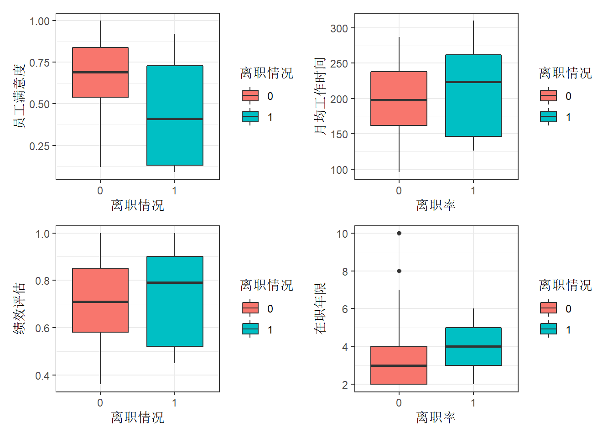
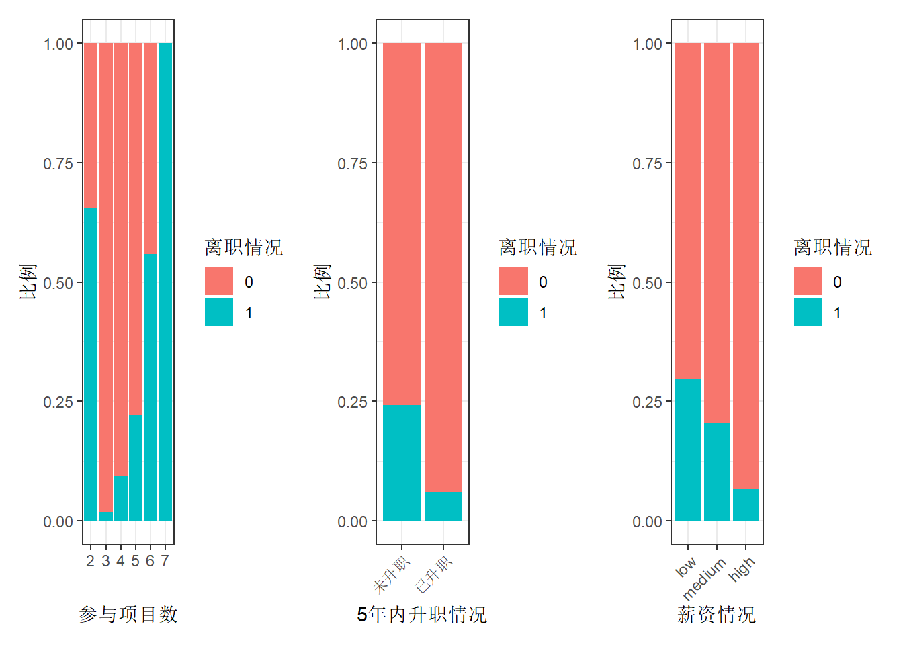

---
output:
  html_document: default
  pdf_document: default
  always_allow_html: true
---

# 员工离职分析 {#HR-comma-sep}


## 描述性分析 {#sec:first2}

### 数据概览 {#sec:first21}


```r
hr <- read.csv("data/HR_comma_sep.csv")
summary(hr)
```

```
##  satisfaction_level last_evaluation  number_project  average_montly_hours
##  Min.   :0.0900     Min.   :0.3600   Min.   :2.000   Min.   : 96.0       
##  1st Qu.:0.4400     1st Qu.:0.5600   1st Qu.:3.000   1st Qu.:156.0       
##  Median :0.6400     Median :0.7200   Median :4.000   Median :200.0       
##  Mean   :0.6128     Mean   :0.7161   Mean   :3.803   Mean   :201.1       
##  3rd Qu.:0.8200     3rd Qu.:0.8700   3rd Qu.:5.000   3rd Qu.:245.0       
##  Max.   :1.0000     Max.   :1.0000   Max.   :7.000   Max.   :310.0       
##  time_spend_company Work_accident         left        promotion_last_5years
##  Min.   : 2.000     Min.   :0.0000   Min.   :0.0000   Min.   :0.00000      
##  1st Qu.: 3.000     1st Qu.:0.0000   1st Qu.:0.0000   1st Qu.:0.00000      
##  Median : 3.000     Median :0.0000   Median :0.0000   Median :0.00000      
##  Mean   : 3.498     Mean   :0.1446   Mean   :0.2381   Mean   :0.02127      
##  3rd Qu.: 4.000     3rd Qu.:0.0000   3rd Qu.:0.0000   3rd Qu.:0.00000      
##  Max.   :10.000     Max.   :1.0000   Max.   :1.0000   Max.   :1.00000      
##     sales              salary         
##  Length:14999       Length:14999      
##  Class :character   Class :character  
##  Mode  :character   Mode  :character  
##                                       
##                                       
## 
```
观察各个变量的主要描述统计量，可知：

- 离职率（`left`）平均将近24%。
- 对公司的满意度（`satisfaction_level`）仅有62%左右。
- 平均每个人参加过的项目数（`number_project`）仅为3~4个。
- 员工每月平均工作时间（`average_montly_hours`）达到201.1小时，按照每月工作20天（去除8天双休）计算，每个员工平均每天工作超过10小时。

### 员工离职情况与员工满意度、月均工作时间、绩效评估和在职年限的关系 {#sec:first22}

我们通过绘图观察离职员工的特点。


```r
hr$left <- factor(hr$left, levels = c("0", "1"))

# 离职率与公司满意度关系
boxSat <- ggplot(hr, aes(x = left, y = satisfaction_level,
                          fill = left)) +
  geom_boxplot() +
  theme_bw() +
  labs(x = "离职情况", y = "员工满意度") +
  guides(fill = guide_legend(title = "离职情况"))

# 离职率与绩效评估的关系
boxEva <- ggplot(hr, aes(x = left, y = last_evaluation,
                         fill = left)) +
  geom_boxplot() +
  theme_bw() +
  labs(x = "离职情况", y = "绩效评估") +
  guides(fill = guide_legend(title = "离职情况"))

# 离职率与月均工作时间的关系
boxMonth <- ggplot(hr, aes(x = left, y = average_montly_hours, fill = left)) +
  geom_boxplot() +
  theme_bw()+
  labs(x = "离职率", y = "月均工作时间") +
  guides(fill = guide_legend(title = "离职情况"))

# 离职率与工作年限的关系
boxTime <- ggplot(hr, aes(x = left, y = time_spend_company, fill = left)) +
  geom_boxplot() +
  theme_bw() +
  labs(x = "离职率", y = "在职年限") +
  guides(fill = guide_legend(title = "离职情况"))

boxSat/boxEva |boxMonth/boxTime
```

<div class="figure" style="text-align: center">

<p class="caption">(\#fig:boxplot-resigned)(ref:fig-resigned)</p>
</div>
(ref:fig-resigned) 员工离职情况与员工满意度、月均工作时间、绩效评估和在职年限的关系。

由图\@ref(fig:boxplot-resigned)可以看出，离职员工的几个特点：

   - 左上图：离职员工的满意度明显低于未离职的满意度，大都集中于0.4左右。
   - 左下图：离职员工的绩效评估较高。推测离职员工倾向于寻找待遇更好的工作。
   - 右上图：离职员工的月均工作时长较高，大部分超过了平均水平（200小时）。
   - 右下图：工作年限均在4年左右。

### 员工离职情况与项目参与个数、五年内升职情况和薪资的关系 {#sec:first23}


```r
hr$number_project <- factor(hr$number_project,
                            levels = c("2", "3", "4", "5", "6", "7"))

# 离职与参与项目数关系
barProject <- ggplot(hr, aes(x = number_project, fill = left)) +
  geom_bar(position = "fill") + # fill为百分比条形图
  theme_bw() +
  labs(x = "参与项目数", y = "比例") +
  guides(fill = guide_legend(title = "离职情况"))


# 离职与升职情况关系
hr$promotion_last_5years[hr$promotion_last_5years == 1] <- "已升职"
hr$promotion_last_5years[hr$promotion_last_5years == 0] <- "未升职"

bar5years <- ggplot(hr, aes(x = as.factor(promotion_last_5years), fill = left)) + 
  geom_bar(position = "fill") +
  theme_bw() +
  labs(x = "5年内升职情况", y = "比例") +
  theme(axis.text.x = element_text(angle = 45,
                                   hjust = 1)) +
  guides(fill = guide_legend(title = "离职情况"))

# 离职与薪资关系
barSalary <- ggplot(hr, aes(x = factor(salary, levels = c("low", "medium", "high"), ordered=TRUE), fill = left)) +
  geom_bar(position = "fill") +
  theme_bw() +
  labs(x = "薪资情况", y = "比例") +
  theme(axis.text.x = element_text(angle = 45,
                                   hjust = 1)) +
  guides(fill = guide_legend(title = "离职情况")) 

barProject|bar5years |barSalary
```

<div class="figure" style="text-align: center">

<p class="caption">(\#fig:barplot-resigned)(ref:fig-bar-resigned)</p>
</div>
(ref:fig-bar-resigned) 员工离职情况与项目参与个数、五年内升职情况和薪资的关系。

由图\@ref(fig:barplot-resigned)可以看出，离职员工的几个特点：

   - 参与项目过少（2个）与过多（7个）的员工离职率均比较高。且参与项目在3个及以上时，参与项目越多，离职率越高。
   - 5年内未升职的员工离职率较高。
   - 薪资越低，离职率越高。

## 建模预测1-回归树+混淆矩阵 {#sec:three-model1}

建模的思路：

1. 提取所需数据。

2. 定义交叉验证方法。

3. 进行分层抽样，提取出想要的训练集和测试集。

4. 实际建模。

5. 对数据进行预测（利用混淆矩阵的方式）。

### 提取数据

选择符合条件的样本。通过绩效评估、在职时间和参与项目数筛选出更有代表性的样本数据进行分析。
按照绩效评估、在职时间、参与项目数量


```r
hr_model <- hr %>% 
  filter(last_evaluation >= 0.70 |
           time_spend_company>=4 |
           number_project>=5)
```

### 确定交叉验证方法


```r
# cv为设置交叉验证方法，number = 5为5折交叉验证。
train_control <- trainControl(method = "cv",
                              number = 5)
```

### 分层抽样 [^分层抽样]


```r
# 设定随机种子，确保每次抽样结果一致。
set.seed(1234)

# 根据数据因变量进行7:3的分层抽样，返回行索引向量 p = 0.7为按照7：3进行抽样
# 参数list表示返回值是否为列表
index <- createDataPartition(hr_model$left,
                             p = 0.7, list = F)
# 以index为索引的数据为训练集
# 剩余的数据为测试集
trainData <- hr_model[index, ]
testData <- hr_model[-index, ]
```

[^分层抽样]: 分层抽样法也叫类型抽样法。它是从一个可以分成不同子总体（或称为层）的总体中，按规定的比例从不同层中随机抽取样品（个体）的方法。这种方法的优点是，样本的代表性比较好，抽样误差比较小。缺点是抽样手续较简单随机抽样还要繁杂些。定量调查中的分层抽样是一种卓越的概率抽样方式，在调查中经常被使用。

### 实际建模

使用`carte`包中的`train`函数对训练集进行5折交叉验证建立回归树模型。


```r
# left~. 代表因变量left与所有自变量进行建模。
rpartmodel <- train(left~., data = trainData,
                    trControl = train_control,
                    method = "rpart")
```

利用建立好的模型`rpartmodel`对测试集进行预测。


```r
# testdata[-7]剔除left列。
predRpart <- predict(rpartmodel, testData[-7])
```

建立混淆矩阵，验证建立的模型。


```r
conPart <- table(predRpart, testData$left)
conPart
```

```
##          
## predRpart    0    1
##         0 2246   72
##         1   51  528
```

>混淆矩阵：混淆矩阵的每一列代表了预测类别，每一列的总数表示预测为该类别的数据的数目；每一行代表了数据的真实归属类别，每一行的数据总数表示该类别的数据实例的数目。根据查全率和查准率两个参数判断模型拟合结果是否够好。

混淆矩阵的查准率和查全率是两个重要的参数，具体计算公式如下式\@ref(eq:three-CM)：

\begin{align}
  查准率=\frac{真正例}{真正例+假正例} \\
  查全率=\frac{真正例}{真正例+假反例}
  (\#eq:three-CM)
\end{align}

根据混淆矩阵结果，可以得到回归树模型的：

1. 查准率为91.19 %。

2. 查全率为88 %。

回归模型的拟合效果不错。

## 建模预测2-朴素贝叶斯  {#sec:three-model2}

建模步骤与第\@ref(sec:three-model1)小结基本相同，下面只列出代码及结果。


```r
nbModel <- train(left~., data = trainData,
                 trControl = train_control,
                 method = "nb")
predNb <- predict(nbModel, testData[-7])
conNb <- table(predNb, testData$left)
conNb
```

```
##       
## predNb    0    1
##      0 2248  146
##      1   49  454
```

根据公式\@ref(eq:three-CM)，计算得到朴素贝叶斯模型的：

1. 查准率为90.26 %。

2. 查全率为75.67 %。

通过两种模型的评估，我们发现回归树模型的拟合度比朴素贝叶斯更好，所以接下来我们采用回归数模型进行进一步分析。

## 模型评估及应用 {#sec:three-model-use}

- 本部分使用`ROC`曲线的方法对模型进行评估。具体步骤如下：

   - 根据建模预测的结果对样例进行排序。
   - 按照排序逐个把样本作为正例进行预测，每次计算出两个重要的值（分别为假正例率和真正例率，具体计算公式见下式\@ref(eq:three-ROC)。
  
   \begin{align}
      假正例率 = \frac{假正例}{假正例+真反例} \\
      真正例率 = \frac{真正例}{真正例+假反例}(查全率)
      (\#eq:three-ROC)
   \end{align}

   - 分别以计算的两个值作为横纵坐标，就得到了`ROC`曲线。

- `ROC`曲线的评估方法：

   - 如果一个模型的`ROC`曲线被另一个模型的`ROC`曲线完全“包住”，说明后者的性能优于前者。
   - 如果两个`ROC`曲线发生交叉，则难以一般性的断言两者的优劣。如果一定要进行比较，较为合理的判断依据是比较ROC曲线下的面积（`AUC`）。一般情况下，如果
   
### `ROC`曲线绘制

绘制`ROC`曲线的数据必须是数值型。


```r
predRpart <- as.numeric(as.character(predRpart))
predNb <- as.numeric(predNb)
```

转换后绘制图形。


```r
# 获取后续绘图使用的信息
rocPart <- roc(testData$left, predRpart)

# 计算两个关键值
# 假正例率
specificityRp <- rocPart$specificities
# 查全率，即真正利率
sensitivityRp <- rocPart$sensitivities
```


```r
# 获取后续绘图使用的信息
rocNb <- roc(testData$left, predNb)

# 计算两个关键值
# 假正例率
specificityNb <- rocNb$specificities
# 查全率，即真正利率
sensitivityNb <- rocNb$sensitivities
```

绘制`ROC`图形。


```r
# 定义data = NULL声明未用任何数据
pRpart <- ggplot(data = NULL, aes(
  x = 1 - specificityRp, 
  y = sensitivityRp)) +
  geom_line(color = "red") +
  geom_abline() +
  annotate("text", x = 0.4, y = 0.5, 
           label = paste("AUC = ", 
                         round(rocPart$auc, 3))) +
  theme_bw() +
  labs(x = "1 - Specificity", y = "Sensitivities")

pNb <- ggplot(data = NULL, aes(
  x = 1 - specificityNb,
  y = sensitivityNb)) +
  geom_line(color = "red") +
  geom_abline() +
  annotate("text", x = 0.4, y = 0.5,
           label = paste("AUC = ",
                         round(rocNb$auc, 3))) +
  theme_bw() +
  labs(x = "1 - Specificity", y = " ")

pRpart|pNb
```

<div class="figure" style="text-align: center">

<p class="caption">(\#fig:ROC)回归树模型和朴素贝叶斯模型`ROC`曲线</p>
</div>
(ref:fig-ROC) 

从AUC值来看，同样是回归树模型的拟合效果好于朴素贝叶斯模型。

## 模型应用

使用回归树模型预测分类的概率，绘制交互预测表


```r
# type = "prob"表示结果显示为概率
# predEnd <- predict(rpartmodel, testData[-7],
#                   type = "prob")

# 合并预测结果及概率
# dataEnd <- cbind(round(predEnd, 3), predRpart)

# 重命名预测结果表列名。
# names(dataEnd) <- c("pred.0", "pred.1", "pred")

# head(dataEnd)
# 生成交互式表格
# datatable(dataEnd)
```


