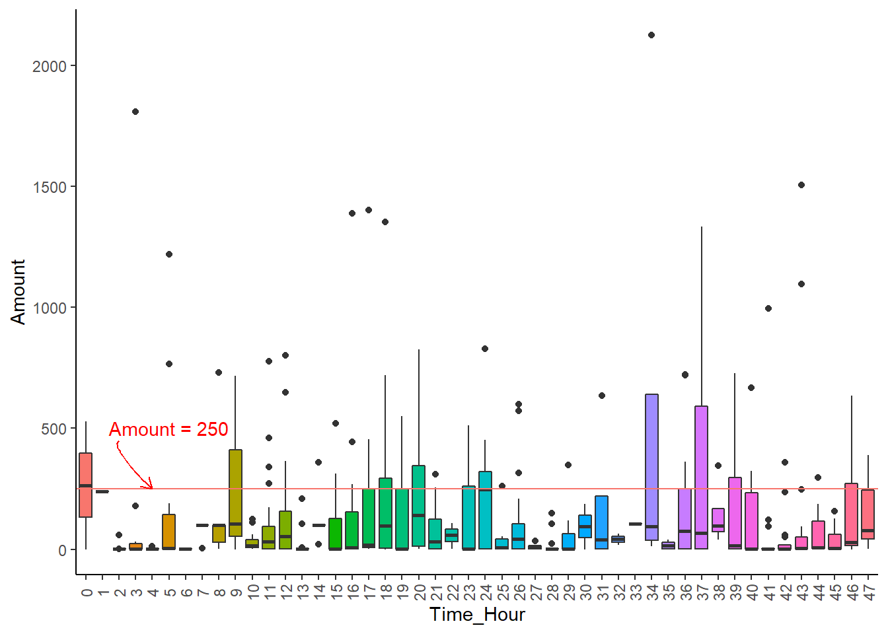

---
output:
  html_document: default
  pdf_document: default
---

# 信用卡欺诈识别 {#creditcard}


## 数据变量说明 {#sec:five1}

[变量说明](https://www.kaggle.com/arockiaselciaa/creditcardcsv)

`class`变量：0表示非欺诈，1表示非欺诈。

## 数据预处理 {#sec:five2}


```r
card <- read_csv("data/creditcard.csv")
```

```
## Rows: 284807 Columns: 31
```

```
## -- Column specification --------------------------------------------------------
## Delimiter: ","
## dbl (31): Time, V1, V2, V3, V4, V5, V6, V7, V8, V9, V10, V11, V12, V13, V14,...
```

```
## 
## i Use `spec()` to retrieve the full column specification for this data.
## i Specify the column types or set `show_col_types = FALSE` to quiet this message.
```

```r
card <- as.data.frame(card)
str(card) # 查看数据基本结构和数据类型
```

```
## 'data.frame':	284807 obs. of  31 variables:
##  $ Time  : num  0 0 1 1 2 2 4 7 7 9 ...
##  $ V1    : num  -1.36 1.192 -1.358 -0.966 -1.158 ...
##  $ V2    : num  -0.0728 0.2662 -1.3402 -0.1852 0.8777 ...
##  $ V3    : num  2.536 0.166 1.773 1.793 1.549 ...
##  $ V4    : num  1.378 0.448 0.38 -0.863 0.403 ...
##  $ V5    : num  -0.3383 0.06 -0.5032 -0.0103 -0.4072 ...
##  $ V6    : num  0.4624 -0.0824 1.8005 1.2472 0.0959 ...
##  $ V7    : num  0.2396 -0.0788 0.7915 0.2376 0.5929 ...
##  $ V8    : num  0.0987 0.0851 0.2477 0.3774 -0.2705 ...
##  $ V9    : num  0.364 -0.255 -1.515 -1.387 0.818 ...
##  $ V10   : num  0.0908 -0.167 0.2076 -0.055 0.7531 ...
##  $ V11   : num  -0.552 1.613 0.625 -0.226 -0.823 ...
##  $ V12   : num  -0.6178 1.0652 0.0661 0.1782 0.5382 ...
##  $ V13   : num  -0.991 0.489 0.717 0.508 1.346 ...
##  $ V14   : num  -0.311 -0.144 -0.166 -0.288 -1.12 ...
##  $ V15   : num  1.468 0.636 2.346 -0.631 0.175 ...
##  $ V16   : num  -0.47 0.464 -2.89 -1.06 -0.451 ...
##  $ V17   : num  0.208 -0.115 1.11 -0.684 -0.237 ...
##  $ V18   : num  0.0258 -0.1834 -0.1214 1.9658 -0.0382 ...
##  $ V19   : num  0.404 -0.146 -2.262 -1.233 0.803 ...
##  $ V20   : num  0.2514 -0.0691 0.525 -0.208 0.4085 ...
##  $ V21   : num  -0.01831 -0.22578 0.248 -0.1083 -0.00943 ...
##  $ V22   : num  0.27784 -0.63867 0.77168 0.00527 0.79828 ...
##  $ V23   : num  -0.11 0.101 0.909 -0.19 -0.137 ...
##  $ V24   : num  0.0669 -0.3398 -0.6893 -1.1756 0.1413 ...
##  $ V25   : num  0.129 0.167 -0.328 0.647 -0.206 ...
##  $ V26   : num  -0.189 0.126 -0.139 -0.222 0.502 ...
##  $ V27   : num  0.13356 -0.00898 -0.05535 0.06272 0.21942 ...
##  $ V28   : num  -0.0211 0.0147 -0.0598 0.0615 0.2152 ...
##  $ Amount: num  149.62 2.69 378.66 123.5 69.99 ...
##  $ Class : num  0 0 0 0 0 0 0 0 0 0 ...
```

```r
summary(card) # 查看数据的主要描述性统计量
```

```
##       Time              V1                  V2                  V3          
##  Min.   :     0   Min.   :-56.40751   Min.   :-72.71573   Min.   :-48.3256  
##  1st Qu.: 54202   1st Qu.: -0.92037   1st Qu.: -0.59855   1st Qu.: -0.8904  
##  Median : 84692   Median :  0.01811   Median :  0.06549   Median :  0.1799  
##  Mean   : 94814   Mean   :  0.00000   Mean   :  0.00000   Mean   :  0.0000  
##  3rd Qu.:139321   3rd Qu.:  1.31564   3rd Qu.:  0.80372   3rd Qu.:  1.0272  
##  Max.   :172792   Max.   :  2.45493   Max.   : 22.05773   Max.   :  9.3826  
##        V4                 V5                   V6                 V7          
##  Min.   :-5.68317   Min.   :-113.74331   Min.   :-26.1605   Min.   :-43.5572  
##  1st Qu.:-0.84864   1st Qu.:  -0.69160   1st Qu.: -0.7683   1st Qu.: -0.5541  
##  Median :-0.01985   Median :  -0.05434   Median : -0.2742   Median :  0.0401  
##  Mean   : 0.00000   Mean   :   0.00000   Mean   :  0.0000   Mean   :  0.0000  
##  3rd Qu.: 0.74334   3rd Qu.:   0.61193   3rd Qu.:  0.3986   3rd Qu.:  0.5704  
##  Max.   :16.87534   Max.   :  34.80167   Max.   : 73.3016   Max.   :120.5895  
##        V8                  V9                 V10                 V11          
##  Min.   :-73.21672   Min.   :-13.43407   Min.   :-24.58826   Min.   :-4.79747  
##  1st Qu.: -0.20863   1st Qu.: -0.64310   1st Qu.: -0.53543   1st Qu.:-0.76249  
##  Median :  0.02236   Median : -0.05143   Median : -0.09292   Median :-0.03276  
##  Mean   :  0.00000   Mean   :  0.00000   Mean   :  0.00000   Mean   : 0.00000  
##  3rd Qu.:  0.32735   3rd Qu.:  0.59714   3rd Qu.:  0.45392   3rd Qu.: 0.73959  
##  Max.   : 20.00721   Max.   : 15.59500   Max.   : 23.74514   Max.   :12.01891  
##       V12                V13                V14                V15          
##  Min.   :-18.6837   Min.   :-5.79188   Min.   :-19.2143   Min.   :-4.49894  
##  1st Qu.: -0.4056   1st Qu.:-0.64854   1st Qu.: -0.4256   1st Qu.:-0.58288  
##  Median :  0.1400   Median :-0.01357   Median :  0.0506   Median : 0.04807  
##  Mean   :  0.0000   Mean   : 0.00000   Mean   :  0.0000   Mean   : 0.00000  
##  3rd Qu.:  0.6182   3rd Qu.: 0.66251   3rd Qu.:  0.4931   3rd Qu.: 0.64882  
##  Max.   :  7.8484   Max.   : 7.12688   Max.   : 10.5268   Max.   : 8.87774  
##       V16                 V17                 V18           
##  Min.   :-14.12985   Min.   :-25.16280   Min.   :-9.498746  
##  1st Qu.: -0.46804   1st Qu.: -0.48375   1st Qu.:-0.498850  
##  Median :  0.06641   Median : -0.06568   Median :-0.003636  
##  Mean   :  0.00000   Mean   :  0.00000   Mean   : 0.000000  
##  3rd Qu.:  0.52330   3rd Qu.:  0.39968   3rd Qu.: 0.500807  
##  Max.   : 17.31511   Max.   :  9.25353   Max.   : 5.041069  
##       V19                 V20                 V21           
##  Min.   :-7.213527   Min.   :-54.49772   Min.   :-34.83038  
##  1st Qu.:-0.456299   1st Qu.: -0.21172   1st Qu.: -0.22839  
##  Median : 0.003735   Median : -0.06248   Median : -0.02945  
##  Mean   : 0.000000   Mean   :  0.00000   Mean   :  0.00000  
##  3rd Qu.: 0.458949   3rd Qu.:  0.13304   3rd Qu.:  0.18638  
##  Max.   : 5.591971   Max.   : 39.42090   Max.   : 27.20284  
##       V22                  V23                 V24          
##  Min.   :-10.933144   Min.   :-44.80774   Min.   :-2.83663  
##  1st Qu.: -0.542350   1st Qu.: -0.16185   1st Qu.:-0.35459  
##  Median :  0.006782   Median : -0.01119   Median : 0.04098  
##  Mean   :  0.000000   Mean   :  0.00000   Mean   : 0.00000  
##  3rd Qu.:  0.528554   3rd Qu.:  0.14764   3rd Qu.: 0.43953  
##  Max.   : 10.503090   Max.   : 22.52841   Max.   : 4.58455  
##       V25                 V26                V27            
##  Min.   :-10.29540   Min.   :-2.60455   Min.   :-22.565679  
##  1st Qu.: -0.31715   1st Qu.:-0.32698   1st Qu.: -0.070840  
##  Median :  0.01659   Median :-0.05214   Median :  0.001342  
##  Mean   :  0.00000   Mean   : 0.00000   Mean   :  0.000000  
##  3rd Qu.:  0.35072   3rd Qu.: 0.24095   3rd Qu.:  0.091045  
##  Max.   :  7.51959   Max.   : 3.51735   Max.   : 31.612198  
##       V28                Amount             Class         
##  Min.   :-15.43008   Min.   :    0.00   Min.   :0.000000  
##  1st Qu.: -0.05296   1st Qu.:    5.60   1st Qu.:0.000000  
##  Median :  0.01124   Median :   22.00   Median :0.000000  
##  Mean   :  0.00000   Mean   :   88.35   Mean   :0.001728  
##  3rd Qu.:  0.07828   3rd Qu.:   77.17   3rd Qu.:0.000000  
##  Max.   : 33.84781   Max.   :25691.16   Max.   :1.000000
```

```r
round(prop.table(table(card$Class)),4)# 查看数据类别比例
```

```
## 
##      0      1 
## 0.9983 0.0017
```

### 分层抽样 {#sec:five22}

处理类别不平衡的数据需要了解的几个概念点：

1. 类别不平衡：指分类任务重不同类别的训练样本树木差别很大的情况。

2. 欠抽样：指某类（样本数占比很大）的样本中抽取出与另一类样本（样本数占比很小）个数一样的样本。即从大类别中抽取与小类别数目一样的样本。

3. 过抽样：指针对样本数占比很小的类别，重新塑造一些数据，使其与另一类数据接近。

对数据进行一些基本转化。


```r
# 把Time列转换为小时
card <- card %>% 
  mutate(Time_Hour = round(card[, 1]/3600, 0))

# 把Class列转化为因子型
card$Class <- factor(card$Class)

card_1 <- card[card$Class == "1", ] # 欺诈样本
card_0 <- card[card$Class == "0", ] # 非欺诈样本
```

随机抽取与诈骗样本个数相同的非欺诈样本数据，并与元欺诈样本合并为新的数据。此处使用的欠抽样的方法。


```r
set.seed(1234)
index <- sample(x = 1:nrow(card_0), size = nrow(card_1))
card_0_new <- card_0[index, ]
card_end <- rbind(card_0_new, card_1)

# 剔除Time列，用Time_Hour列代替。everything()选择所有的变量
card_end <- card_end[-1] %>% 
  select(Time_Hour, everything())
```

按照类别进行分层抽样，建立训练集和测试集。


```r
set.seed(1234)
# 按照新数据的目标变量进行8：2
index2 <- createDataPartition(card_end$Class,
                              p = 0.8, list = F)
train_data <- card_end[index2, ] # 创建训练集
test_data <- card_end[-index2, ] # 创建测试集

# 验证抽样结果，统计三个数据集中正反样本比例是否一致
table(card_end$Class)
```

```
## 
##   0   1 
## 492 492
```

```r
table(train_data$Clas)
```

```
## 
##   0   1 
## 394 394
```

```r
table(test_data$Class)
```

```
## 
##  0  1 
## 98 98
```

### 标准化 {#sec:five23}


```r
standard <- preProcess(card_end, method = "range") 
card_s <- predict(standard, card_end)
train_data2 <- card_s[index2, ]
test_data2 <- card_s[-index2, ]
```

## 描述性分析 {#sec:five3}

### 不同时间诈骗次数-条形图


```r
ggplot(card_1, aes(x = factor(Time_Hour), 
                   fill = factor(Time_Hour)))+
  geom_bar(stat = "count") +
  theme_classic() +
  labs(x = "Time_Hour", y = "Count") +
  theme(legend.position = "none",
        axis.text.x = element_text(angle = 90,
                                   vjust = 0.5))
```

<div class="figure" style="text-align: center">

<p class="caption">(\#fig:card-times)不同时间诈骗次数</p>
</div>

由图\@ref(fig:card-times)可知：

- 第一天（0~24h）的诈骗总次数大于第二天（25~48h）。
- 诈骗发生次数最多的三个时间段分别是：

   1. 第二天凌晨2点左右。
   2. 第一天上午11点左右。
   3. 第一天凌晨2点左右。

### 不同时间诈骗金额-箱线图


```r
ggplot(card_1, aes(x = factor(Time_Hour),
                   y = Amount, 
                   fill = factor(Time_Hour))) +
  geom_boxplot() +
  geom_hline(aes(yintercept =250, color = "red")) + 
  annotate("text", x = 6, y = 500, label = "Amount = 250", color = "red") +
  geom_curve(x = 3, y = 450, xend = 5, yend = 250, angle = 25, color = "red",
             arrow = arrow(length = unit(0.25, "cm"))) +
  theme_classic() +
  labs(x = "Time_Hour", y = "Amount") +
  theme(legend.position = "none", 
        axis.text.x = element_text(angle = 90, 
                                   vjust = 0.5))
```

<div class="figure" style="text-align: center">

<p class="caption">(\#fig:card-amount)不同时间诈骗金额</p>
</div>

由图\@ref(fig:card-amount)可知：

- 诈骗金额最多的一次发生在第二天下午1点作用（34h），诈骗金额达到2000欧元左右。

- 诈骗金额普遍在250欧元之内。

### 不同时间平均诈骗金额-条形图


```r
# 提取所需数据
card_1_mean <- card_1 %>% 
  group_by(Time_Hour) %>% 
  summarise(MeanAmount = mean(Amount))


ggplot(card_1_mean, aes(x = factor(Time_Hour), y = MeanAmount, fill = factor(Time_Hour))) +
  geom_bar(stat = "identity") +
  geom_hline(aes(yintercept = 200, color = "red")) +
  annotate("text", x = 26, y = 240, label = "Mean_Amount = 200", color = "red") +
  geom_curve(x = 23, y = 220, xend = 24, yend = 200, 
             curvature = 0.3, arrow = arrow(length = unit(0.2, "cm")), color = "red") +
  theme_classic() +
  theme(legend.position = "none",
        axis.text.x = element_text(angle = 90, vjust = 0.5)) +
  labs(x = "Time_Hour", y = "Mean_Amount")
```

<div class="figure" style="text-align: center">

<p class="caption">(\#fig:card-mean)不同时间平均诈骗金额-条形图</p>
</div>

如图\@ref(fig:card-mean)所示：

- 平均诈骗金额最多的时间段为第二天下午1点，此时间点包含诈骗金额最多的观测。
- 总体而言，平均诈骗金额普遍在200欧元以内。

## 自动参数调整调参-使用`caret`包 {#sec:five4}

**参数调整**是提升模型性能的一个重要过程，而大多数机器学习算法都可以至少调整一个参数。复杂的模型通常可以通过调节多个参数值来调整模型从而达到更好的拟合效果。

e.g.，寻找最合适的k值来调整k近邻模型、调节隐藏层层数和隐藏层的节点数来优化神经网络模型；又如支持向量机模型中的调节核函数以及“软边界”惩罚大小等优化。

值得注意的是，如果对所有可能的调参选项均进行尝试，其复杂度非常大，耗时且不科学，需要一种更系统、科学的方式对模型的参数进行调节。

下表列举了使用`caret`包进行自动参数调整的模型及其参数：

|          模型          | 方法名    | 参数                    |
| :--------------------: | :-------: | :---------------------: |
|         k近邻          | knn       | k                       |
|       朴素贝叶斯       | nb        | fL、usekernel           |
|         决策树         | C5.0      | model、trials、winnow   |
|     OneR规则学习器     | OneR      | 无                      |
|        线性回归        | lm        | 无                      |
|         回归树         | rpart     | cp                      |
|         模型树         | M5        | pruned、smoothed、rules |
| 支持向量机（径向基核） | svmRadial | C, sigma                |
|        随机森林        | rf        | mtry                    |

[更多可调节参数的详细信息](http://topepo.github.io/caret/available-models.html)

本案例我们使用knn和随机森林两个模型。


我们用iris数据对自动调参的步骤进行演示。

1. 创建简单的调整的模型


```r
set.seed(1234)
m_C50 <- train(Species~., data = iris, method = "C5.0")
```

```
## Warning: 'trials' should be <= 1 for this object. Predictions generated using 1
## trials

## Warning: 'trials' should be <= 1 for this object. Predictions generated using 1
## trials
```

```
## Warning: 'trials' should be <= 8 for this object. Predictions generated using 8
## trials
```

```
## Warning: 'trials' should be <= 4 for this object. Predictions generated using 4
## trials
```

```
## Warning: 'trials' should be <= 8 for this object. Predictions generated using 8
## trials
```

```
## Warning: 'trials' should be <= 4 for this object. Predictions generated using 4
## trials
```

```
## Warning: 'trials' should be <= 1 for this object. Predictions generated using 1
## trials

## Warning: 'trials' should be <= 1 for this object. Predictions generated using 1
## trials

## Warning: 'trials' should be <= 1 for this object. Predictions generated using 1
## trials

## Warning: 'trials' should be <= 1 for this object. Predictions generated using 1
## trials
```

```
## Warning: 'trials' should be <= 4 for this object. Predictions generated using 4
## trials

## Warning: 'trials' should be <= 4 for this object. Predictions generated using 4
## trials
```

```
## Warning: 'trials' should be <= 8 for this object. Predictions generated using 8
## trials
```

```
## Warning: 'trials' should be <= 6 for this object. Predictions generated using 6
## trials
```

```
## Warning: 'trials' should be <= 8 for this object. Predictions generated using 8
## trials
```

```
## Warning: 'trials' should be <= 6 for this object. Predictions generated using 6
## trials
```

```
## Warning: 'trials' should be <= 1 for this object. Predictions generated using 1
## trials

## Warning: 'trials' should be <= 1 for this object. Predictions generated using 1
## trials

## Warning: 'trials' should be <= 1 for this object. Predictions generated using 1
## trials

## Warning: 'trials' should be <= 1 for this object. Predictions generated using 1
## trials

## Warning: 'trials' should be <= 1 for this object. Predictions generated using 1
## trials

## Warning: 'trials' should be <= 1 for this object. Predictions generated using 1
## trials

## Warning: 'trials' should be <= 1 for this object. Predictions generated using 1
## trials
```

```
## Warning: 'trials' should be <= 6 for this object. Predictions generated using 6
## trials
```

```
## Warning: 'trials' should be <= 1 for this object. Predictions generated using 1
## trials
```

```
## Warning: 'trials' should be <= 8 for this object. Predictions generated using 8
## trials
```

```
## Warning: 'trials' should be <= 9 for this object. Predictions generated using 9
## trials

## Warning: 'trials' should be <= 9 for this object. Predictions generated using 9
## trials

## Warning: 'trials' should be <= 9 for this object. Predictions generated using 9
## trials

## Warning: 'trials' should be <= 9 for this object. Predictions generated using 9
## trials
```

```
## Warning: 'trials' should be <= 4 for this object. Predictions generated using 4
## trials

## Warning: 'trials' should be <= 4 for this object. Predictions generated using 4
## trials

## Warning: 'trials' should be <= 4 for this object. Predictions generated using 4
## trials
```

```
## Warning: 'trials' should be <= 3 for this object. Predictions generated using 3
## trials
```

```
## Warning: 'trials' should be <= 4 for this object. Predictions generated using 4
## trials
```

```
## Warning: 'trials' should be <= 3 for this object. Predictions generated using 3
## trials
```

```
## Warning: 'trials' should be <= 1 for this object. Predictions generated using 1
## trials
```

```
## Warning: 'trials' should be <= 8 for this object. Predictions generated using 8
## trials
```

```
## Warning: 'trials' should be <= 1 for this object. Predictions generated using 1
## trials
```

```
## Warning: 'trials' should be <= 8 for this object. Predictions generated using 8
## trials
```

```r
m_C50
```

```
## C5.0 
## 
## 150 samples
##   4 predictor
##   3 classes: 'setosa', 'versicolor', 'virginica' 
## 
## No pre-processing
## Resampling: Bootstrapped (25 reps) 
## Summary of sample sizes: 150, 150, 150, 150, 150, 150, ... 
## Resampling results across tuning parameters:
## 
##   model  winnow  trials  Accuracy   Kappa    
##   rules  FALSE    1      0.9353579  0.9019696
##   rules  FALSE   10      0.9370844  0.9045424
##   rules  FALSE   20      0.9325835  0.8976068
##   rules   TRUE    1      0.9382311  0.9062975
##   rules   TRUE   10      0.9407392  0.9099910
##   rules   TRUE   20      0.9385430  0.9066136
##   tree   FALSE    1      0.9347127  0.9009924
##   tree   FALSE   10      0.9369888  0.9044013
##   tree   FALSE   20      0.9332286  0.8985820
##   tree    TRUE    1      0.9375860  0.9053246
##   tree    TRUE   10      0.9399845  0.9088007
##   tree    TRUE   20      0.9392443  0.9076915
## 
## Accuracy was used to select the optimal model using the largest value.
## The final values used for the model were trials = 10, model = rules and
##  winnow = TRUE.
```
由上面的结果可以看出，基于`model`、`trials`和`winnow`三个参数，建立并测试了12个决策树（C5.0）模型，每个模型均给出了精度及Kappa统计量，最下方同时展示了最佳候选模型所对应的参数值。其中Kappa统计量用来衡量模型的稳定性：

   - 很差的一致性： <0.2
   - 尚可的一致性： 0.2~0.4
   - 中等的一致性： 0.4~0.6
   - 不错的一致性： 0.6~0.8
   - 很好的一致性： 0.8~1

2. 定制调参

- 使用trainCotrol()函数创建一些列配置选项，这些选项考虑了包括重抽样策略以及用于选择最佳模型的度量这些模型评价标准的管理。主要专注于两个重要的参数：method和selectionFuncio。

   - method为冲抽样的方法。
   - selectionFunction参数可以设定一个函数，用于在各个候选者中选取特定的模型，共3个函数：
      
      - **best**函数：默认选项，简单的选择具有最好的某特定度量值的候选者。
      - **oneSE**函数：选择最好性能标准差之内的最简单的候选者。
      - **Tolerance**函数：选择某个用户制定比例之内最简单的候选者。
      

```r
set.seed(1234)
model_rf <- train(Class~., data = train_data, method = "rf",
                 trControl = trainControl(method = "cv",
                                          number = 5,
                                          selectionFunction = "oneSE"))
model_rf
```

```
## Random Forest 
## 
## 788 samples
##  30 predictor
##   2 classes: '0', '1' 
## 
## No pre-processing
## Resampling: Cross-Validated (5 fold) 
## Summary of sample sizes: 631, 631, 630, 630, 630 
## Resampling results across tuning parameters:
## 
##   mtry  Accuracy   Kappa    
##    2    0.9276465  0.8552977
##   16    0.9314521  0.8628921
##   30    0.9276627  0.8553120
## 
## Accuracy was used to select the optimal model using  the one SE rule.
## The final value used for the model was mtry = 2.
```

```r
# 进行预测
pred_rf <- predict(model_rf, test_data[-31]) 
```

```r
# 建立混淆矩阵
confusionMatrix(data = pred_rf, reference = test_data$Class,
                positive = "1")
```

```
## Confusion Matrix and Statistics
## 
##           Reference
## Prediction  0  1
##          0 98  7
##          1  0 91
##                                           
##                Accuracy : 0.9643          
##                  95% CI : (0.9278, 0.9855)
##     No Information Rate : 0.5             
##     P-Value [Acc > NIR] : < 2e-16         
##                                           
##                   Kappa : 0.9286          
##                                           
##  Mcnemar's Test P-Value : 0.02334         
##                                           
##             Sensitivity : 0.9286          
##             Specificity : 1.0000          
##          Pos Pred Value : 1.0000          
##          Neg Pred Value : 0.9333          
##              Prevalence : 0.5000          
##          Detection Rate : 0.4643          
##    Detection Prevalence : 0.4643          
##       Balanced Accuracy : 0.9643          
##                                           
##        'Positive' Class : 1               
## 
```

```r
plot(varImp(model_rf)) # 查看变量的重要性
```


## kNN建模 {#sec:five5}

### 原理

knn，即邻近分类器，就是把未标记的案例归类为与他们最相似的带有标记的案例所在的类。

算法流程：

1. 依次计算测试样本与哥哥训练样本间的距离（常用欧式距离）；

2. 将这些距离按照升序排列；

3. 选取距离最小的k（3~10）个训练样本点；

4. 确定这k个点中不同类别的占比；

5. 返回这k个点中占比最大的类别作为测试样本的预测分类。

### 模型建立


```r
# 创建空向量
results <- c()

for (i in 3:10){
  set.seed(1234)
  pred_knn <- knn(train_data2[-31], test_data2[-31],
                  train_data2$Class, i)
  Table <- table(pred_knn, test_data2$Class) # 得到混淆矩阵
  accuracy <- sum(diag(Table))/sum(Table) # diag()提取对角线的值
  results <- c(results, accuracy)
}

ggplot(as.data.frame(results), aes(x = 3:10, y = results)) +
  geom_point()+
  geom_line() +
  theme_bw() +
  labs(xlab = " ")
```


```r
set.seed(1234)
pred_knn <- knn(train = train_data2[-31], test = test_data2[-31],
                cl = train_data2$Class, k = 4)
confusionMatrix(pred_knn,test_data2$Class, positive = "1")
```

```
## Confusion Matrix and Statistics
## 
##           Reference
## Prediction  0  1
##          0 97  7
##          1  1 91
##                                           
##                Accuracy : 0.9592          
##                  95% CI : (0.9212, 0.9822)
##     No Information Rate : 0.5             
##     P-Value [Acc > NIR] : <2e-16          
##                                           
##                   Kappa : 0.9184          
##                                           
##  Mcnemar's Test P-Value : 0.0771          
##                                           
##             Sensitivity : 0.9286          
##             Specificity : 0.9898          
##          Pos Pred Value : 0.9891          
##          Neg Pred Value : 0.9327          
##              Prevalence : 0.5000          
##          Detection Rate : 0.4643          
##    Detection Prevalence : 0.4694          
##       Balanced Accuracy : 0.9592          
##                                           
##        'Positive' Class : 1               
## 
```

## 模型评估 {#sec:five6}


```r
# 建立一个数据框，将两个模型预测的结果和真实值放进去。并展示不同预测值
pred_results <- data.frame(knn = pred_knn, rf = pred_rf, 
                           class = test_data$Class)
index3 <- which(pred_results$knn != pred_rf)
pred_results[index3, ]
```

```
##     knn rf class
## 25    1  0     0
## 159   1  0     1
## 160   0  1     1
## 168   1  0     1
## 182   0  1     1
```

