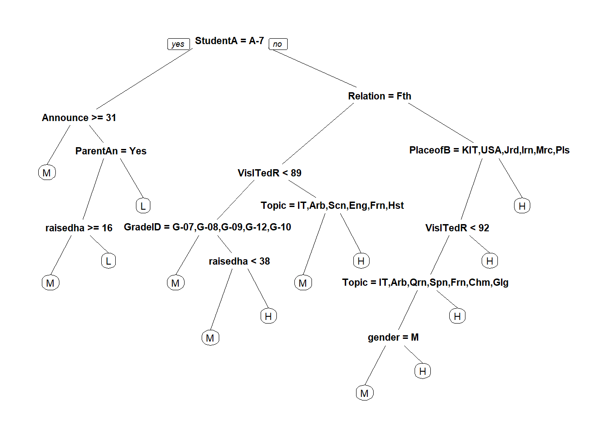

---
output:
  html_document: default
  pdf_document: default
---

# 学生成绩水平分类 {#scoreClass}


## 数据变量说明 {#sec:data-intro-edu}

[变量说明](https://www.kaggle.com/aljarah/xAPI-Edu-Data)。

变量中最重要的的为`Class`学生等级变量，是我们建模的目标变量。


```r
edudata <- read_csv("data/xAPI-Edu-Data.csv")
edudata$Class <- factor(edudata$Class, levels = c("H", "M", "L"))
edudata$gender <- factor(edudata$gender, levels = c("M", "F"))
str(edudata)
```

```
## spec_tbl_df [480 x 17] (S3: spec_tbl_df/tbl_df/tbl/data.frame)
##  $ gender                  : Factor w/ 2 levels "M","F": 1 1 1 1 1 ..
##  $ NationalITy             : chr [1:480] "KW" "KW" "KW" "KW" ...
##  $ PlaceofBirth            : chr [1:480] "KuwaIT" "KuwaIT" "KuwaIT"..
##  $ StageID                 : chr [1:480] "lowerlevel" "lowerlevel""..
##  $ GradeID                 : chr [1:480] "G-04" "G-04" "G-04" "G-0"..
##  $ SectionID               : chr [1:480] "A" "A" "A" "A" ...
##  $ Topic                   : chr [1:480] "IT" "IT" "IT" "IT" ...
##  $ Semester                : chr [1:480] "F" "F" "F" "F" ...
##  $ Relation                : chr [1:480] "Father" "Father" "Father"..
##  $ raisedhands             : num [1:480] 15 20 10 30 40 42 35 50 12..
##  $ VisITedResources        : num [1:480] 16 20 7 25 50 30 12 10 21 ..
##  $ AnnouncementsView       : num [1:480] 2 3 0 5 12 13 0 15 16 25 ...
##  $ Discussion              : num [1:480] 20 25 30 35 50 70 17 22 50..
##  $ ParentAnsweringSurvey   : chr [1:480] "Yes" "Yes" "No" "No" ...
##  $ ParentschoolSatisfaction: chr [1:480] "Good" "Good" "Bad" "Bad" ..
##  $ StudentAbsenceDays      : chr [1:480] "Under-7" "Under-7" "Abov"..
##  $ Class                   : Factor w/ 3 levels "H","M","L": 2 2 3 ..
##  - attr(*, "spec")=
##   .. cols(
##   ..   gender = col_character(),
##   ..   NationalITy = col_character(),
##   ..   PlaceofBirth = col_character(),
##   ..   StageID = col_character(),
##   ..   GradeID = col_character(),
##   ..   SectionID = col_character(),
##   ..   Topic = col_character(),
##   ..   Semester = col_character(),
##   ..   Relation = col_character(),
##   ..   raisedhands = col_double(),
##   ..   VisITedResources = col_double(),
##   ..   AnnouncementsView = col_double(),
##   ..   Discussion = col_double(),
##   ..   ParentAnsweringSurvey = col_character(),
##   ..   ParentschoolSatisfaction = col_character(),
##   ..   StudentAbsenceDays = col_character(),
##   ..   Class = col_character()
##   .. )
##  - attr(*, "problems")=<externalptr>
```


## 描述性分析 {#sec:descriptive-analysis}

### 封装绘图函数


```r
fun_bar <- function(data, xlab, fillc, pos, xname, yname, legend){
  data %>% 
    group_by({{xlab}}) %>% # dplyr中的自定函数参数需要使用{{}}括起来
    mutate(count = n()) %>% 
      ggplot(aes(reorder({{xlab}}, count), count, fill = {{fillc}})) +
      geom_col(position = pos) + #pos = "stack" or "fill"
      labs(x = xname, y = yname) +
      coord_flip() +
      theme_bw() +
      guides(fill = guide_legend(title = legend))
}
```

### 不同教育程度的学生选择课程主题


```r
p1 <- fun_bar(data = edudata, xlab = Topic, fillc = StageID,
             pos = "stack", xname = "Topic", yname = "Student_Count",
             legend = "教育程度")
p2 <- fun_bar(data = edudata, xlab = Topic, fillc = StageID,
             pos = "fill", xname = "Topic", yname = "Per_Student_Count",
             legend = "教育程度")
p1/p2
```

<div class="figure">

<p class="caption">(\#fig:school-level)不同教育程度的学生选择课程主题</p>
</div>
由图\@ref(fig:school-level)可以看出：

- 课程主题最多的为IT、French和Arabic，其中选择IT的课程主题的学员远高于其他课。

- 无论哪种教育程度，IT、Science、Math和English四种课程都是必修的（三种颜色都有）。

### 不同课程主题监护人情况

这部分主要针对家长的情况进行分析，了解父母对学员学习的不同情况。对应在数据集中的变量为`Relation`。


```r
p3 <- fun_bar(data = edudata, xlab = Topic, fillc = Relation,
              pos = "stack", xname = "Topic", yname = "Student_count",
              legend = "监护人情况")
p4 <- fun_bar(data = edudata, xlab = Topic, fillc = Relation,
              pos = "fill", xname = "Topic", yname = "Student_count",
              legend = "监护人情况")
p3/p4
```

<div class="figure">

<p class="caption">(\#fig:relation)不同课程主题监护人情况</p>
</div>

由图\@ref(fig:relation)可以看出：

- 总体而言，监护人为父亲的较多。其中，IT和Math课程中，负责人为父亲的超过75%。

- French课程，监护人大多数为母亲，占70%左右。

### 不同课程学生学习成绩


```r
p5 <- fun_bar(data = edudata, xlab = Topic, fillc = Class,
              pos = "stack", xname = "Topic", yname = "Student_count",
              legend = "学生成绩")
p6 <- fun_bar(data = edudata, xlab = Topic, fillc = Class,
              pos = "fill", xname = "Topic", yname = "Student_count",
              legend = "学生成绩")
p5/p6
```

<div class="figure">

<p class="caption">(\#fig:class)不同课程学生学习成绩</p>
</div>
由图\@ref(fig:class):

- 所有课程中，只有Biology课程中，属于高水平的学生数超过了50%。

- 在Geology课程中，没有低水平的学生。

### 不同教室学生成绩水平


```r
p7 <- fun_bar(data = edudata, xlab = SectionID, fillc = Class,
              pos = "stack", xname = "Section_ID", yname = "Student_count",
              legend = "学生成绩")
p8 <- fun_bar(data = edudata, xlab = SectionID, fillc = Class,
              pos = "fill", xname = "Section_ID", yname = "Student_count",
              legend = "学生成绩")
p7/p8
```

<div class="figure">

<p class="caption">(\#fig:score-section)不同教室学生成绩水平</p>
</div>

由图\@ref(fig:score-section)可以看出：

- 在A班的学生最多，C班的学生最少。

- C班的低水平成绩的学生相对较多，其它两个班级的成绩水平基本一致。

### 不同学期、不同成绩水平与监护人的关系


```r
# 封装函数，去掉坐标轴翻转
fun_bar2 <- function(data, xlab, fillc, pos, xname, yname, legend){
  data %>% 
    group_by({{xlab}}) %>% # dplyr中的自定函数参数需要使用{{}}括起来
    mutate(count = n()) %>% 
      ggplot(aes(reorder({{xlab}}, count), count, fill = {{fillc}})) +
      geom_col(position = pos) + #pos = "stack" or "fill"
      labs(x = xname, y = yname) +
      theme_bw() +
      guides(fill = guide_legend(title = legend))
}
```


```r
p9 <- fun_bar2(edudata, Semester, Relation, pos = "stack",
              xname = "Semester", yname = "Student_count",
              legend = "监护人情况")

p10 <- fun_bar2(edudata, Semester, Relation, pos = "fill",
              xname = "Semester", yname = "per_Student_count",
              legend = "监护人情况")

p11 <- fun_bar2(edudata, Class, Relation, pos = "stack",
               xname = "Class", yname = "Student_count",
               legend = "监护人情况")

p12 <- fun_bar2(edudata, Class, Relation, pos = "fill",
               xname = "Class", yname = "per_Student_count",
               legend = "监护人情况")
(p9|p10) / (p11|p12)
```

<div class="figure">

<p class="caption">(\#fig:semester)不同学期、不同成绩水平与监护人的关系</p>
</div>
由图\@ref(fig:semester)可知：

- 第一学期父亲作为监护人的学生数比第二学期多。

- 总体看，成绩水平较高的学生中，监护人为母亲的比较多；其它水平均是父亲较多。

### 家长是否回答调查问卷、成绩水平与家长对学校是否满意的关系


```r
p13 <- fun_bar2(edudata, ParentAnsweringSurvey, ParentschoolSatisfaction, 
                pos = "stack", xname = "ParentAnsweringSurvey",
                yname = "Student_count", legend = "是否满意")
p14 <- fun_bar2(edudata, ParentAnsweringSurvey, ParentschoolSatisfaction, 
                pos = "fill", xname = "ParentAnsweringSurvey",
                yname = "Per_Student_count", legend = "是否满意")

p15 <- fun_bar2(edudata, Class, ParentschoolSatisfaction, 
                pos = "stack", xname = "Class",
                yname = "Student_count", legend = "是否满意")
p16 <- fun_bar2(edudata, Class, ParentschoolSatisfaction, 
                pos = "fill", xname = "Class",
                yname = "Per_Student_count", legend = "是否满意")
(p13|p14)/(p15|p16)
```

<div class="figure">

<p class="caption">(\#fig:surey-class)家长是否回答调查问卷、成绩水平与家长对学校是否满意的关系</p>
</div>
由图\@ref(fig:surey-class)可以看出：

- 有超过一半的家长回答了问卷，其中，回答问卷的家长大部分对学校满意，而未回答问卷的则大部分对学校不满。

- 成绩越高，家长对学校越满意。

### 性别、逃课次数与学生成绩水平的关系


```r
p17 <- fun_bar2(edudata, gender, Class, 
                pos = "stack", xname = "Gender",
                yname = "Student_count", legend = "成绩水平")
p18 <- fun_bar2(edudata, gender, Class, 
                pos = "fill", xname = "Gender",
                yname = "Per_Student_count", legend = "成绩水平")

p19 <- fun_bar2(edudata, StudentAbsenceDays, Class, 
                pos = "stack", xname = "Class",
                yname = "Student_count", legend = "成绩水平")
p20 <- fun_bar2(edudata, StudentAbsenceDays, Class, 
                pos = "fill", xname = "Class",
                yname = "Per_Student_count", legend = "成绩水平")
(p17|p18)/(p19|p20)
```

<div class="figure">

<p class="caption">(\#fig:gender-absence)性别、逃课次数与学生成绩水平的关系</p>
</div>
由图\@ref(fig:gender-absence)可知：

- 女生比男生数量少很多，但高水平成绩的人数明显比男生多；中水平成绩男女比例基本持平。

- 逃课超过7天的的学生基本无法取得好的成绩。

### 举手次数和参加讨论次数与成绩水平关系


```r
fun_bar3 <- function(data, xlab, ylab, fillc, xname, yname){
  data %>% 
    group_by({{xlab}}) %>% 
    summarise(Mcount = mean({{ylab}})) %>% 
     ggplot(aes({{xlab}}, Mcount, fill = {{fillc}})) +
      geom_col() + 
      labs(x = xname, y = yname) +
      theme_bw() +
      theme(legend.position = "none")
}
```


```r
# edudata$Class <- factor(edudata$Class, c("H", "M", "L"), ordered = TRUE)
p21 <- fun_bar3(data = edudata, xlab = Class, ylab = raisedhands, 
                fillc = Class, "成绩水平", "平均举手次数" )

p22 <- fun_bar3(data = edudata, xlab = Class, ylab = Discussion, 
                fillc = Class, "成绩水平", "平均参与讨论次数" )
p21|p22
```

<div class="figure">

<p class="caption">(\#fig:raisedhands-discuss)举手次数和参加讨论次数与成绩水平关系</p>
</div>
由图\@ref(fig:raisedhands-discuss)可知： 举手次数和参与讨论次数越多，成绩水平越高。

***

## 模型建立

### 回归树模型建立


```r
set.seed(1234)
# 按照数据目标8:2进行分层抽样，返回矩阵形式的抽样索引
index <- createDataPartition(edudata$Class, p = 0.8, list = F)
train <- edudata[index, ]
test <- edudata[-index, ]

# 建立回归树模型
rpart_model <- rpart(Class ~., data = train)
# type = "class"指定预测结果是具体的某个类别
pred_rp <- predict(rpart_model, test[-17], type = "class")
confusionMatrix(pred_rp, test$Class)
```

```
## Confusion Matrix and Statistics
## 
##           Reference
## Prediction  H  M  L
##          H 18  3  0
##          M  9 29  3
##          L  1 10 22
## 
## Overall Statistics
##                                           
##                Accuracy : 0.7263          
##                  95% CI : (0.6252, 0.8128)
##     No Information Rate : 0.4421          
##     P-Value [Acc > NIR] : 1.882e-08       
##                                           
##                   Kappa : 0.5806          
##                                           
##  Mcnemar's Test P-Value : 0.05103         
## 
## Statistics by Class:
## 
##                      Class: H Class: M Class: L
## Sensitivity            0.6429   0.6905   0.8800
## Specificity            0.9552   0.7736   0.8429
## Pos Pred Value         0.8571   0.7073   0.6667
## Neg Pred Value         0.8649   0.7593   0.9516
## Prevalence             0.2947   0.4421   0.2632
## Detection Rate         0.1895   0.3053   0.2316
## Detection Prevalence   0.2211   0.4316   0.3474
## Balanced Accuracy      0.7990   0.7320   0.8614
```

```r
prp(rpart_model)
```


### 随机数模型


```r
set.seed(1234)
# importance = T:稍后对变量进行重要性的可视化
rf_model <- randomForest(Class~., data = train, importance = T)
pred_rf <- predict(rf_model, test[-17], type = "class")
confusionMatrix(pred_rf, test$Class) # 混淆矩阵判断模型准确率
```

```
## Confusion Matrix and Statistics
## 
##           Reference
## Prediction  H  M  L
##          H 20  4  0
##          M  8 36  4
##          L  0  2 21
## 
## Overall Statistics
##                                           
##                Accuracy : 0.8105          
##                  95% CI : (0.7172, 0.8837)
##     No Information Rate : 0.4421          
##     P-Value [Acc > NIR] : 1.886e-13       
##                                           
##                   Kappa : 0.7032          
##                                           
##  Mcnemar's Test P-Value : NA              
## 
## Statistics by Class:
## 
##                      Class: H Class: M Class: L
## Sensitivity            0.7143   0.8571   0.8400
## Specificity            0.9403   0.7736   0.9714
## Pos Pred Value         0.8333   0.7500   0.9130
## Neg Pred Value         0.8873   0.8723   0.9444
## Prevalence             0.2947   0.4421   0.2632
## Detection Rate         0.2105   0.3789   0.2211
## Detection Prevalence   0.2526   0.5053   0.2421
## Balanced Accuracy      0.8273   0.8154   0.9057
```

```r
varImpPlot(rf_model) # 可视化变量重要性函数
```


阅读上图：

- 圆点越靠近右侧越重要。

- 我们重点观察排名前五的变量。通过左右两图的对比发现，两图中前四个变量相同（交叉），可以判定这四个变量是数据中最重要的变量。

### SVM建模-支持向量机(需要再研究)


```r
set.seed(1234)
library(kernlab) # Kernel-Based Machine Learning Lab
svm_model <- ksvm(Class~., data = test, kernel = "rbfdot")
# type = "response":指定预测结果是具体的某个列别
pred_svm <- predict(svm_model, test[-17], type = "response")
confusionMatrix(pred_svm, test$Class)
```

```
## Confusion Matrix and Statistics
## 
##           Reference
## Prediction  H  M  L
##          H 23  4  0
##          M  5 36  1
##          L  0  2 24
## 
## Overall Statistics
##                                          
##                Accuracy : 0.8737         
##                  95% CI : (0.7897, 0.933)
##     No Information Rate : 0.4421         
##     P-Value [Acc > NIR] : < 2.2e-16      
##                                          
##                   Kappa : 0.8053         
##                                          
##  Mcnemar's Test P-Value : NA             
## 
## Statistics by Class:
## 
##                      Class: H Class: M Class: L
## Sensitivity            0.8214   0.8571   0.9600
## Specificity            0.9403   0.8868   0.9714
## Pos Pred Value         0.8519   0.8571   0.9231
## Neg Pred Value         0.9265   0.8868   0.9855
## Prevalence             0.2947   0.4421   0.2632
## Detection Rate         0.2421   0.3789   0.2526
## Detection Prevalence   0.2842   0.4421   0.2737
## Balanced Accuracy      0.8809   0.8720   0.9657
```

### 模型融合

将各个模型的结果做一个融合（合并至一个数据框）。


```r
result <- data.frame(rpart = pred_rp,
                     randomForest = pred_rf,
                     svm = pred_svm,
                     actual_class = test$Class, 
                     final_pred = rep("-", nrow(test)))
head(result)
```

```
##   rpart randomForest svm actual_class final_pred
## 1     M            M   M            M          -
## 2     L            L   L            L          -
## 3     L            L   L            L          -
## 4     M            M   L            M          -
## 5     L            L   L            L          -
## 6     M            M   M            M          -
```


```r
# 封装求众数函数
fun_pred <- function(x){
  names(which.max(table(x)))
}

result$final_pred <- factor(apply(result[1:2], 1, fun_pred))
confusionMatrix(result$actual_class, result$final_pred)
```

```
## Confusion Matrix and Statistics
## 
##           Reference
## Prediction  H  L  M
##          H 21  1  6
##          L  0 23  2
##          M  7 10 25
## 
## Overall Statistics
##                                           
##                Accuracy : 0.7263          
##                  95% CI : (0.6252, 0.8128)
##     No Information Rate : 0.3579          
##     P-Value [Acc > NIR] : 3.029e-13       
##                                           
##                   Kappa : 0.5887          
##                                           
##  Mcnemar's Test P-Value : 0.09327         
## 
## Statistics by Class:
## 
##                      Class: H Class: L Class: M
## Sensitivity            0.7500   0.6765   0.7576
## Specificity            0.8955   0.9672   0.7258
## Pos Pred Value         0.7500   0.9200   0.5952
## Neg Pred Value         0.8955   0.8429   0.8491
## Prevalence             0.2947   0.3579   0.3474
## Detection Rate         0.2211   0.2421   0.2632
## Detection Prevalence   0.2947   0.2632   0.4421
## Balanced Accuracy      0.8228   0.8218   0.7417
```

```r
head(result)
```

```
##   rpart randomForest svm actual_class final_pred
## 1     M            M   M            M          M
## 2     L            L   L            L          L
## 3     L            L   L            L          L
## 4     M            M   L            M          M
## 5     L            L   L            L          L
## 6     M            M   M            M          M
```

## mlr3模型建立


```r
edudata <- read_csv("data/xAPI-Edu-Data.csv", show_col_types = FALSE,
                    col_types = "fffffffffddddffff")
spec(edudata)
```

```
## cols(
##   gender = col_factor(levels = NULL, ordered = FALSE, include_na = FALSE),
##   NationalITy = col_factor(levels = NULL, ordered = FALSE, include_na = FALSE),
##   PlaceofBirth = col_factor(levels = NULL, ordered = FALSE, include_na = FALSE),
##   StageID = col_factor(levels = NULL, ordered = FALSE, include_na = FALSE),
##   GradeID = col_factor(levels = NULL, ordered = FALSE, include_na = FALSE),
##   SectionID = col_factor(levels = NULL, ordered = FALSE, include_na = FALSE),
##   Topic = col_factor(levels = NULL, ordered = FALSE, include_na = FALSE),
##   Semester = col_factor(levels = NULL, ordered = FALSE, include_na = FALSE),
##   Relation = col_factor(levels = NULL, ordered = FALSE, include_na = FALSE),
##   raisedhands = col_double(),
##   VisITedResources = col_double(),
##   AnnouncementsView = col_double(),
##   Discussion = col_double(),
##   ParentAnsweringSurvey = col_factor(levels = NULL, ordered = FALSE, include_na = FALSE),
##   ParentschoolSatisfaction = col_factor(levels = NULL, ordered = FALSE, include_na = FALSE),
##   StudentAbsenceDays = col_factor(levels = NULL, ordered = FALSE, include_na = FALSE),
##   Class = col_factor(levels = NULL, ordered = FALSE, include_na = FALSE)
## )
```

### 回归树模型


```r
library(mlr3verse)
# 建立任务
set.seed(1234)
task_rp <- 
  TaskClassif$new(id = "edu_rp", backend = edudata,
                  target = "Class")
task_rp
```

```
## <TaskClassif:edu_rp> (480 x 17)
## * Target: Class
## * Properties: multiclass
## * Features (16):
##   - fct (12): GradeID, NationalITy, ParentAnsweringSurvey,
##     ParentschoolSatisfaction, PlaceofBirth, Relation,
##     SectionID, Semester, StageID, StudentAbsenceDays, Topic,
##     gender
##   - dbl (4): AnnouncementsView, Discussion, VisITedResources,
##     raisedhands
```

```r
# 选择学习器
learner_rp <- lrn("classif.rpart")

# 划分测试集和训练集
train_set <- sample(task_rp$nrow, 0.8 * task_rp$nrow)
test_set <- setdiff(seq_len(task_rp$nrow), train_set)

# 模型训练
learner_rp$train(task_rp, row_ids = train_set)
learner_rp$model
```

```
## n= 384 
## 
## node), split, n, loss, yval, (yprob)
##       * denotes terminal node
## 
##   1) root 384 215 M (0.44010417 0.26562500 0.29427083)  
##     2) StudentAbsenceDays=Above-7 157  64 L (0.38853503 0.59235669 0.01910828)  
##       4) AnnouncementsView>=30.5 62  16 M (0.74193548 0.20967742 0.04838710) *
##       5) AnnouncementsView< 30.5 95  15 L (0.15789474 0.84210526 0.00000000)  
##        10) ParentAnsweringSurvey=Yes 25  10 L (0.40000000 0.60000000 0.00000000)  
##          20) raisedhands>=15.5 11   3 M (0.72727273 0.27272727 0.00000000) *
##          21) raisedhands< 15.5 14   2 L (0.14285714 0.85714286 0.00000000) *
##        11) ParentAnsweringSurvey=No 70   5 L (0.07142857 0.92857143 0.00000000) *
##     3) StudentAbsenceDays=Under-7 227 117 H (0.47577093 0.03964758 0.48458150)  
##       6) Relation=Father 110  40 M (0.63636364 0.08181818 0.28181818)  
##        12) VisITedResources< 88.5 82  21 M (0.74390244 0.09756098 0.15853659)  
##          24) GradeID=G-07,G-08,G-09,G-12,G-10 47   5 M (0.89361702 0.08510638 0.02127660) *
##          25) GradeID=G-04,G-06,G-11,G-02 35  16 M (0.54285714 0.11428571 0.34285714)  
##            50) raisedhands< 37.5 22   7 M (0.68181818 0.18181818 0.13636364) *
##            51) raisedhands>=37.5 13   4 H (0.30769231 0.00000000 0.69230769) *
##        13) VisITedResources>=88.5 28  10 H (0.32142857 0.03571429 0.64285714)  
##          26) Topic=IT,Arabic,Science,English,French,History 16   7 M (0.56250000 0.06250000 0.37500000) *
##          27) Topic=Quran,Biology,Chemistry,Geology 12   0 H (0.00000000 0.00000000 1.00000000) *
##       7) Relation=Mum 117  38 H (0.32478632 0.00000000 0.67521368)  
##        14) PlaceofBirth=KuwaIT,USA,Jordan,Iran,Morocco,Palestine 93  37 H (0.39784946 0.00000000 0.60215054)  
##          28) VisITedResources< 91.5 76  36 H (0.47368421 0.00000000 0.52631579)  
##            56) Topic=IT,Arabic,Quran,Spanish,French,Chemistry,Geology 49  19 M (0.61224490 0.00000000 0.38775510)  
##             112) gender=M 30   8 M (0.73333333 0.00000000 0.26666667) *
##             113) gender=F 19   8 H (0.42105263 0.00000000 0.57894737) *
##            57) Topic=Science,English,History,Biology 27   6 H (0.22222222 0.00000000 0.77777778) *
##          29) VisITedResources>=91.5 17   1 H (0.05882353 0.00000000 0.94117647) *
##        15) PlaceofBirth=lebanon,Egypt,venzuela,Tunis,Syria,Iraq 24   1 H (0.04166667 0.00000000 0.95833333) *
```

```r
# 模型预测
pred_rp <- learner_rp$predict(task_rp, row_ids = test_set)
pred_rp
```

```
## <PredictionClassif> for 96 observations:
##     row_ids truth response
##           1     M        M
##           5     M        L
##           7     L        L
## ---                       
##         469     L        L
##         470     L        L
##         478     M        M
```

```r
# 精度
pred_rp$confusion
```

```
##         truth
## response  M  L  H
##        M 27  7 12
##        L  3 18  0
##        H 12  0 17
```

```r
measure <- msr("classif.acc")
pred_rp$score(measure) # 预测精度
```

```
## classif.acc 
##   0.6458333
```


```r
prp(learner_rp$model) # 作图
```



### 随机森林模型


```r
# 建立任务
task_rf <- TaskClassif$new(id = "task_rf", backend = edudata,
                           target = "Class")

# 选择学习器
learner_rf <- lrn("classif.ranger")

# 使用之前设定好的测试集和训练集进行模型训练和预测
learner_rf$train(task_rf, row_ids = train_set)
learner_rf$model
```

```
## Ranger result
## 
## Call:
##  ranger::ranger(dependent.variable.name = task$target_names, data = task$data(),      probability = self$predict_type == "prob", case.weights = task$weights$weight,      num.threads = 1L) 
## 
## Type:                             Classification 
## Number of trees:                  500 
## Sample size:                      384 
## Number of independent variables:  16 
## Mtry:                             4 
## Target node size:                 1 
## Variable importance mode:         none 
## Splitrule:                        gini 
## OOB prediction error:             22.40 %
```

```r
pred_rf <- learner_rf$predict(task_rf, row_ids = test_set)
pred_rf
```

```
## <PredictionClassif> for 96 observations:
##     row_ids truth response
##           1     M        M
##           5     M        L
##           7     L        L
## ---                       
##         469     L        L
##         470     L        L
##         478     M        M
```

```r
# 精度预测
## 建立混淆矩阵
pred_rf$confusion
```

```
##         truth
## response  M  L  H
##        M 33  3  7
##        L  2 22  0
##        H  7  0 22
```

```r
## 设定精度预测方法
measure <- msr("classif.acc")
## 预测精度
pred_rf$score(measure)
```

```
## classif.acc 
##   0.8020833
```

### 支持向量机模型

[完善内容]{.todo}

1. edudata1 <- read_csv("data/xAPI-Edu-Data.csv",
                     col_types = "")
str(edudata1)

2. 建立任务
edudata1$Class <- factor(edudata1$Class)
task_svm <- TaskClassif$new(id = "task_svm", edudata1,
                            target = "Class")

3. 选择学习器
learner_svm <- lrn("classif.svm")

4. 利用之前确定的训练集训练模型
learner_svm$train(task_svm, row_ids = train_set)
learner_svm$model


