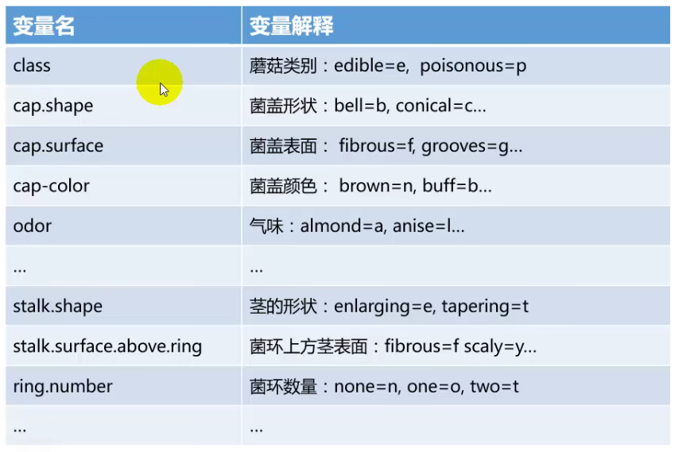

---
output:
  html_document: default
  pdf_document: default
---

# 毒蘑菇分析 {#mushrooms}


## 变量说明


```r
knitr::include_graphics("images/mushrooms-data.jpg", dpi = FALSE)
```

<!-- -->

class为因变量。


```r
files <- "data/mushrooms.csv"
mushrooms <- read_csv(files,show_col_types = FALSE) %>% 
  mutate(across(everything(), factor)) %>% 
  as_tibble()
str(mushrooms) # 查看数据基本结构
```

```
## tibble [8,124 x 23] (S3: tbl_df/tbl/data.frame)
##  $ class                   : Factor w/ 2 levels "e","p": 2 1 1 2 1 ..
##  $ cap-shape               : Factor w/ 6 levels "b","c","f","k",..:..
##  $ cap-surface             : Factor w/ 4 levels "f","g","s","y": 3 ..
##  $ cap-color               : Factor w/ 10 levels "b","c","e","g",....
##  $ bruises                 : Factor w/ 2 levels "FALSE","TRUE": 2 2..
##  $ odor                    : Factor w/ 9 levels "a","c","f","l",..:..
##  $ gill-attachment         : Factor w/ 2 levels "a","f": 2 2 2 2 2 ..
##  $ gill-spacing            : Factor w/ 2 levels "c","w": 1 1 1 1 2 ..
##  $ gill-size               : Factor w/ 2 levels "b","n": 2 1 1 2 1 ..
##  $ gill-color              : Factor w/ 12 levels "b","e","g","h",....
##  $ stalk-shape             : Factor w/ 2 levels "e","t": 1 1 1 1 2 ..
##  $ stalk-root              : Factor w/ 5 levels "?","b","c","e",..:..
##  $ stalk-surface-above-ring: Factor w/ 4 levels "f","k","s","y": 3 ..
##  $ stalk-surface-below-ring: Factor w/ 4 levels "f","k","s","y": 3 ..
##  $ stalk-color-above-ring  : Factor w/ 9 levels "b","c","e","g",..:..
##  $ stalk-color-below-ring  : Factor w/ 9 levels "b","c","e","g",..:..
##  $ veil-type               : Factor w/ 1 level "p": 1 1 1 1 1 1 1 1..
##  $ veil-color              : Factor w/ 4 levels "n","o","w","y": 3 ..
##  $ ring-number             : Factor w/ 3 levels "n","o","t": 2 2 2 ..
##  $ ring-type               : Factor w/ 5 levels "e","f","l","n",..:..
##  $ spore-print-color       : Factor w/ 9 levels "b","h","k","n",..:..
##  $ population              : Factor w/ 6 levels "a","c","n","s",..:..
##  $ habitat                 : Factor w/ 7 levels "d","g","l","m",..:..
```

```r
table(mushrooms$class) # 统计样本种类个数
```

```
## 
##    e    p 
## 4208 3916
```

```r
prop.table(table(mushrooms$class)) # 统计样本种类占比
```

```
## 
##         e         p 
## 0.5179714 0.4820286
```


## 数据预处理-统计每列因子水品个数


```r
# levels()统计因子水平
# length()计算因子水平个数
mushrooms_factor <- mushrooms %>% 
  mutate(across(everything(), factor)) %>% 
  as_tibble() %>% 
  janitor::clean_names()
df1 <- map_dfr(mushrooms_factor, function(x){
  length(levels(x))
}) %>% 
  as.tibble() %>% 
  pivot_longer(cols = everything(),
               names_to = "Factors",
               values_to = "Total_Class")
df1
```

```
## # A tibble: 23 x 2
##    Factors         Total_Class
##    <chr>                 <int>
##  1 class                     2
##  2 cap_shape                 6
##  3 cap_surface               4
##  4 cap_color                10
##  5 bruises                   2
##  6 odor                      9
##  7 gill_attachment           2
##  8 gill_spacing              2
##  9 gill_size                 2
## 10 gill_color               12
## # ... with 13 more rows
```

## 统计建模

### 随机森林模型-mlr3


```r
# 建立任务
task_rf <- TaskClassif$new(id = "task_rf", backend = mushrooms_factor, target = "class")

# 选择学习器
learner_rf <- lrn("classif.ranger")

# 设定测试集和训练集
train_set <- sample(task_rf$nrow, 0.7 * task_rf$nrow)
test_set <- setdiff(seq_len(task_rf$nrow), train_set)

# 使用之前设定好的测试集和训练集进行模型训练和预测
learner_rf$train(task_rf, row_ids = train_set)
learner_rf$model
```

```
## Ranger result
## 
## Call:
##  ranger::ranger(dependent.variable.name = task$target_names, data = task$data(),      probability = self$predict_type == "prob", case.weights = task$weights$weight,      num.threads = 1L) 
## 
## Type:                             Classification 
## Number of trees:                  500 
## Sample size:                      5686 
## Number of independent variables:  22 
## Mtry:                             4 
## Target node size:                 1 
## Variable importance mode:         none 
## Splitrule:                        gini 
## OOB prediction error:             0.00 %
```

```r
pred_rf <- learner_rf$predict(task_rf, row_ids = test_set)
pred_rf
```

```
## <PredictionClassif> for 2438 observations:
##     row_ids truth response
##           1     p        p
##           5     e        e
##           9     p        p
## ---                       
##        8115     p        p
##        8117     p        p
##        8123     p        p
```

```r
# 精度预测
## 建立混淆矩阵
pred_rf$confusion
```

```
##         truth
## response    e    p
##        e 1264    0
##        p    0 1174
```

```r
## 设定精度预测方法
measure <- msr("classif.acc")
## 预测精度
pred_rf$score(measure)
```

```
## classif.acc 
##           1
```
- 可以看到，本例中模型的精确度达到了100%。

- 这是由于本例的数据集是一个经典的、已经经过多次改进的数据集，且数据量较少，导致数据集非常标准。

